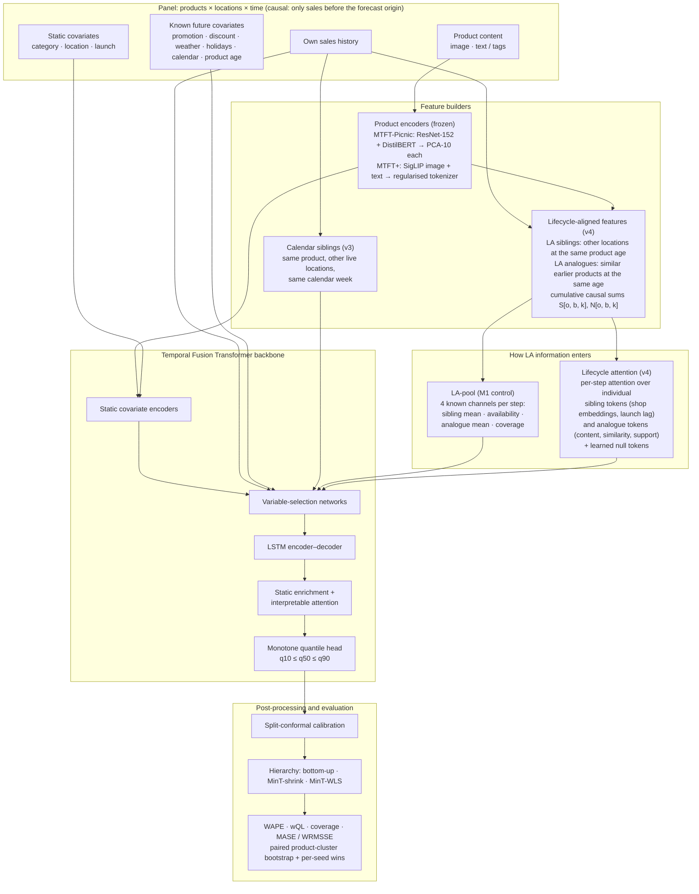

# MTFT+: Extending the Multimodal Temporal Fusion Transformer for Retail Demand Forecasting

**Author:** Om Prakash Bhardwaj · **Status:** active research. VISUELLE 2.0 results are complete; the M5 evaluation is running.

This is the complete research repository of a controlled, multi-version study. It asks: **which extensions actually improve the Multimodal Temporal Fusion Transformer (MTFT; Sukel, Rudinac & Worring, *IEEE MultiMedia* 2024) for product demand forecasting?**

Every idea is tested against a control that adds the same ingredient to the baseline. Every model gets the same data, seeds and budget. Failures are reported alongside successes. From v4 onwards, designs and success criteria were **pre-registered** before any result existed.

Two findings stand out:

1. **Cross-location sibling learning** (v3): feeding each (product, location) series the product's demand at its other locations. This is the most reliable single improvement to the MTFT design. The focused, industry-facing write-up is in the companion repository [mtft-cross-location-siblings](https://github.com/ombdj1209/mtft-cross-location-siblings).
2. **Lifecycle alignment** (v4): borrowing that cross-series information **by product age instead of calendar week**, for short-lifecycle products with staggered launches. The pooled age-aligned information helps. A more expressive attention architecture over it helps only when a series' own history is short or absent. Fully fine-tuned Chronos-2 stays 12–30 WAPE points behind.

> "MTFT-Picnic" is our independent re-implementation of the published MTFT design, not Picnic's code, data or system. The multimodal components are a **proof of concept on public data**: no public grocery dataset provides product images or text together with multi-location sales. Real-data evaluation therefore uses VISUELLE 2.0 (fashion), plus M5 (Walmart), whose FOODS category is grocery.

---

## Contents

1. [Research timeline](#1-research-timeline)
2. [Architecture](#2-architecture)
3. [Headline results](#3-headline-results)
4. [Pre-registration and research rules](#4-pre-registration-and-research-rules)
5. [Datasets and protocols](#5-datasets-and-protocols)
6. [Baselines](#6-baselines)
7. [Reproducing the results](#7-reproducing-the-results)
8. [Repository layout](#8-repository-layout)
9. [Compute, limitations and deviations](#9-compute-limitations-and-deviations)
10. [Licences, data and citation](#10-licences-data-and-citation)

---

## 1. Research timeline

| Version | Hypothesis | Data | Outcome | Lesson |
|---|---|---|---|---|
| **v1** | Aligned SigLIP embeddings + decoder cross-attention beat the MTFT's 10-d static features | Synthetic grocery (1 seed) | Tie overall; **worse on cold start** (0.4469 vs 0.4251) | 768-d embeddings overfit ~900 products; reconcile means, not medians |
| **v2** | Regularised tokenizer + analogue retrieval + conformal calibration | Synthetic (3 seeds) | 0.4113 vs 0.4126, **lost on one seed**; removing cross-attention did not hurt | Fusion is not the bottleneck; cross-series signal is unused |
| **v3** | Cross-location **siblings** (+ aligned embeddings, analogues) | Synthetic (3 seeds) → VISUELLE 2.0 (5 seeds) | Siblings help on every seed, wherever the product has sales at another location; the multimodal increment is small and task-dependent | The transferable ingredient is cross-series information |
| **v4** | Borrow by **product age**, not calendar week; lifecycle attention over age-aligned tokens | VISUELLE 2.0 (pre-registered, 5 seeds) | Pooled lifecycle-aligned (LA) information helps; the attention architecture **fails its pre-registered criterion** and helps only with short or absent own history | Information transfers; architecture is task-dependent |
| v4.1 | History-aware gate on lifecycle attention (exploratory) | VISUELLE 2.0 (seed 1, validation) | **Not adopted** under its pre-registered validation rule | – |
| M5 | Does it transfer to long-lived grocery and general retail? | M5 (Walmart), two splits, FOODS subset | *Running* | – |

Write-ups: [`results/v1`](results/v1/README_v1.md), [`results/v2`](results/v2/README_v2.md), [v3 on synthetic data](docs/method_v1_v3.md), [v3 on VISUELLE 2.0](results/visuelle2/README.md), [v4](results/visuelle2/v4_README.md), [v4.1](results/visuelle2/v41_exploratory.md), [published baselines](results/visuelle2/published_baselines.md). The paper draft is in [`paper/draft.md`](paper/draft.md).

---

## 2. Architecture



**Model family.** Rows are cumulative: each adds to the one above.

| Model | Content features | Cross-series inputs | Role |
|---|---|---|---|
| TFT | – | – | backbone |
| MTFT-Picnic | ResNet-152 + DistilBERT, PCA-10, static | – | published design (re-implemented) |
| M0 = MTFT-Picnic + siblings | as above | calendar siblings | v3 control |
| MTFT+ v3 | SigLIP, regularised, static pooled | calendar siblings + calendar analogues | v3 |
| M1 = M0 + LA-pool | as MTFT-Picnic | + pooled lifecycle-aligned information | v4 information control |
| **MTFT+ v4** | SigLIP + age embedding | calendar siblings + LA-pool + **lifecycle attention** | v4 |
| v4 ablations A1–A4 | – | without attention / analogue branch / sibling branch; unimodal retrieval | attribution |

**Implementation.**
- The LA features are computed once per panel from event times with a single cumulative sum, so any origin and product age is an O(1) lookup (`mtft_plus/lifecycle.py`).
- Tests assert that no feature uses a value at or after the forecast origin.

---

## 3. Headline results

### 3.1 VISUELLE 2.0: calendar benchmark (shop-week, 4 test origins, 5 seeds)

| Model | WAPE | wQL | Cold-start WAPE |
|---|---|---|---|
| All-zeros / last value | 1.0000 / 1.0427 | | |
| Chronos-2, zero-shot (best of 5 variants) | 1.0252 | 0.7118 | 0.9904 |
| Chronos-2, fine-tuned + covariates | 0.7599 | 0.5345 | 0.7475 |
| TFT | 0.6547 | 0.4227 | 0.6457 |
| MTFT-Picnic | 0.6515 | 0.4197 | 0.6420 |
| M0 = MTFT-Picnic + siblings | 0.6446 | 0.4145 | 0.6349 |
| MTFT+ v3 | 0.6434 | 0.4140 | 0.6344 |
| **M1 = M0 + LA-pool** | **0.6409** | **0.4114** | **0.6317** |
| MTFT+ v4 | 0.6443 | 0.4142 | 0.6354 |

### 3.2 VISUELLE 2.0: official protocol (WAPE %, 5 seeds)

| Model | SO-fore 2-1 | SO-fore 2-10 | Demand |
|---|---|---|---|
| Published CrossAttnRNN (paper) | 23.20 | 35.13 | 83.33 (w/ image) |
| CrossAttnRNN, official code re-run, validation-only selection | 87.76 | 87.68 | 83.07 (w/ image; seed 1) |
| Chronos-2, best fine-tuned (validation-chosen) | 80.95 | 94.97 | 80.61 |
| MTFT-Picnic | 68.54 | 67.68 | 64.46 |
| M0 = MTFT-Picnic + siblings | 65.25 | 66.84 | 64.01 |
| MTFT+ v3 | 65.73 | 65.66 | **63.07** |
| M1 = M0 + LA-pool | **65.06** | 66.30 | 64.15 |
| MTFT+ v4 | 65.90 | **65.27** | 63.22 |

### 3.3 Pre-registered criteria and controls

Paired product-cluster bootstrap, 95 % CI; "wins" = per-seed wins.

| Comparison | Calendar | 2-1 | 2-10 | Demand | Verdict |
|---|---|---|---|---|---|
| Siblings: M0 − MTFT-Picnic | **−0.0069** (5/5) | **−3.29** (5/5) | **−0.85** (5/5) | −0.44 n.s. (4/5) | helps wherever other locations have sold the product |
| LA information: M1 − M0 | **−0.0037** (4/5); product level **−0.0145** | **−0.20** (4/5) | **−0.54** (5/5) | +0.13 n.s. (3/5) | helps with own or sibling history |
| **Criterion 1:** v4 − M1 | **+0.0034** (1/5) | **+0.85** (0/5) | **−1.03** (5/5) | **−0.93** (5/5) | **fails** (must pass the calendar benchmark) |
| **Criterion 2:** v4 − best fine-tuned Chronos-2 | **−0.116** (5/5) | **−15.04** (5/5) | **−29.70** (5/5) | **−17.39** (5/5) | **passes** everywhere |

**Chronos-2 got every advantage we could give it:**
- covariates (discount, calendar siblings, LA-pool);
- cross-learning over the product's shops;
- the product's shops as one multivariate group;
- full fine-tuning with a validation-selected learning rate and checkpoint.

Covariates help; grouping by product does not. Details and diagnostics are in [`results/visuelle2/v4_README.md`](results/visuelle2/v4_README.md).

**Published baselines.** Re-run with their official code, the released epoch budget and validation-only checkpoint selection, CrossAttnRNN reaches 87–88 WAPE on the short-observation tasks, against 23–35 published. It does reproduce its published demand number: 83.07 vs 83.33. See [`results/visuelle2/published_baselines.md`](results/visuelle2/published_baselines.md).

**Reconciliation.** On 12-week life cycles, bottom-up beats MinT at every level. MinT-shrink estimates about 600 k node covariances from 16 residual vectors: the system is ill-conditioned, cond ≈ 2.75 × 10¹³, and clamping negative forecasts breaks coherence. The diagnosis is in [`results/visuelle2/diagnostics/`](results/visuelle2/diagnostics/).

### 3.4 Synthetic grocery benchmark (v3, 3 seeds)

| Model | WAPE | Cold-start WAPE |
|---|---|---|
| MTFT-Picnic | 0.4126 | 0.4244 |
| MTFT-Picnic + siblings | 0.4088 | 0.4163 |
| MTFT+ v3 | **0.4072** | **0.4145** |

MinT-shrink halves national WAPE relative to bottom-up here (0.0316 vs 0.0492). Long-lived synthetic series keep stable residual correlations, which the real short-lifecycle data do not.

---

## 4. Pre-registration and research rules

- **Pre-registration.**
  - [`results/v4_preregistration.md`](results/v4_preregistration.md) fixed the v4 models, comparisons and success criteria before any v4 result existed. Every later change is a dated amendment, (a)–(i), recorded before the results it concerns; where an amendment came later, it says so.
  - [`results/m5_preregistration.md`](results/m5_preregistration.md) does the same for M5.
- **Rules applied throughout.**
  - No test-set tuning: all hyperparameters, early stopping, calibration and reconciliation choices use validation data.
  - Equal treatment of every model, with mandatory controls for every new ingredient.
  - At least 5 seeds for real-data claims.
  - Per-seed wins reported next to every bootstrap interval.
  - Negative results reported plainly.

---

## 5. Datasets and protocols

| Dataset | Content | Protocols |
|---|---|---|
| Synthetic grocery (frozen generator, `mtft_plus/data.py`) | 5 fulfilment centres × 1,000 products × 540 days; promotions, weather, holidays, late launches, cold starts | Daily, encoder 56, horizon 14 |
| **VISUELLE 2.0** (Skenderi et al., 2022) | 5,355 fashion products, 110 shops, image + tags; 12 observed weeks per (product, shop); staggered launches | (a) calendar benchmark: weekly, encoder 12, horizon 4, 4 test origins; (b) official SO-fore 2-1, 2-10 and demand tasks, official split and metric |
| **M5** (Makridakis et al., 2022) | 3,049 items × 10 Walmart stores, daily; FOODS / HOBBIES / HOUSEHOLD | Launch = first price week; encoder 56, horizon 28; official evaluation horizon and a pre-registered launch-rich split; FOODS as the grocery subset; WRMSSE implementation reproduces the published M5 benchmarks (Naive 1.752, sNaive 0.847) |

---

## 6. Baselines

- **Trivial:** all-zeros, last value, the lifecycle-aligned sibling mean used directly, and seasonal naive (M5).
- **Classical:** Naive and SES. Our re-runs reproduce the VISUELLE 2.0 paper's numbers to within 0.1.
- **Foundation model: Chronos-2.**
  - Zero-shot: univariate, with covariates, with cross-learning, and with a multivariate group.
  - Fully fine-tuned: target only, + covariates, and group.
  - Learning rate, steps and checkpoint are chosen on validation.
- **Published deep models:** CrossAttnRNN (VISUELLE 2.0 paper) and GTM-Transformer.
  - Re-run from the vendored official code in [`third_party/`](third_party/), with documented compatibility patches.
  - The released epoch budget, with checkpoints chosen on a validation split.
  - The released test-split selection is run only as a diagnostic.

---

## 7. Reproducing the results

```bash
python -m venv .venv && source .venv/bin/activate          # Windows: .venv\Scripts\activate
pip install torch --index-url https://download.pytorch.org/whl/cu124   # or the CPU wheel
pip install -e ".[multimodal,baselines,dev]"
pytest -q tests                                              # 25 tests

# synthetic benchmark (v1–v3), no external data
python benchmark.py --no-ablations --accelerator gpu
python report.py --out results --ours "MTFT+ v3 (ours)"
```

**VISUELLE 2.0.**
1. Request the data from the authors at <https://humaticslab.github.io/forecasting/visuelle> and place it in `visuelle2/`.
2. Build the panels with `examples/convert_visuelle2.py`, `examples/unimodal_features.py` and `examples/prepare_panel.py`.
3. Run `benchmark.py --panel ...` (calendar benchmark), `examples/visuelle2_official.py` (official protocol), `examples/chronos2_baseline.py` (Chronos-2, all variants) and `examples/visuelle2_published.py` (published baselines).

The exact command sequence for the v3 models is at the end of [`results/visuelle2/README.md`](results/visuelle2/README.md). The v4 models, fine-tuned Chronos-2 and published baselines:

```bash
V4="MTFT-Picnic + siblings + LA-pool,MTFT+ v4 (ours),v4 w/o lifecycle attention,v4 w/o analogue attention,v4 w/o sibling attention,v4 unimodal retrieval"
python benchmark.py --panel panel_v2.pkl --seeds 1,2,3,4,5 --no-quotas --epochs 16 --batches-per-epoch 200 --models "$V4" --out results_visuelle2
python examples/visuelle2_official.py --panel panel_v2_full.pkl --src visuelle2 --seeds 1,2,3,4,5 --epochs 16 --batches-per-epoch 200        --models "MTFT-Picnic + siblings + LA-pool,MTFT+ v4 (ours),v4 w/o lifecycle attention" --out results_visuelle2_official
for p in finetune-calendar group-calendar; do python examples/chronos2_baseline.py $p --panel panel_v2.pkl --out results_visuelle2; done
for p in finetune-official group-official; do python examples/chronos2_baseline.py $p --panel panel_v2_full.pkl --out results_visuelle2_official; done
python examples/trivial_baselines.py --panel panel_v2.pkl --out results_visuelle2
python examples/visuelle2_published.py --model crossattn --task 2-10 --use-img 1 --full-budget          # one configuration shown
python examples/visuelle2_published.py --model crossattn --task 2-10 --use-img 1 --official-selection   # released-selection diagnostic
python report.py --out results_visuelle2 --ours "MTFT+ v4 (ours)"
python examples/visuelle2_official.py --report --ours "MTFT+ v4 (ours)" --out results_visuelle2_official
```

**M5.**
1. Download the competition files, for example with `kaggle competitions download -c m5-forecasting-accuracy`, or from a mirror, into `data/m5_raw/`.
2. Build the panels:
   ```bash
   python examples/prepare_m5.py --src data/m5_raw --out panel_m5.pkl
   python examples/prepare_m5.py --src data/m5_raw --out panel_m5_launch.pkl --end-day 1176
   ```
3. Run `benchmark.py`, `examples/chronos2_baseline.py`, `examples/trivial_baselines.py --seasonal` and `examples/m5_wrmsse.py`.

**Hardware and job order.**
- All results come from one NVIDIA RTX 2060 SUPER (8 GB), fp32.
- On Windows (WDDM), concurrent GPU jobs slow each other by about 9×. [`tools/gpu_queue.sh`](tools/gpu_queue.sh) runs jobs sequentially from a queue file.

---

## 8. Repository layout

```
mtft_plus/            library: MTFT backbone and fusion modes, layers, multimodal features, synthetic generator,
                      window dataset (siblings, analogues), lifecycle-aligned features (lifecycle.py),
                      reconciliation (sparse MinT), conformal calibration, metrics, training module
benchmark.py          multi-seed, equal-budget benchmark (synthetic or real panels); all model definitions
report.py             tables, paired bootstrap (bottom and product level), controls, per-seed wins
examples/             data conversion (VISUELLE 2.0, M5), feature extraction, official protocol, Chronos-2,
                      published baselines, trivial baselines, diagnostics, WRMSSE, v4.1 decision rule
tests/                25 unit tests: causality of every feature, sibling / LA correctness, MinT vs closed form, ...
third_party/          vendored official code of the published baselines (own licences; see third_party/README.md)
results/              synthetic results; v1/v2 history; pre-registrations; VISUELLE 2.0 and published-baseline
                      reports; diagnostics (aggregates only)
results_visuelle2*/   VISUELLE 2.0 aggregate tables (calendar / official)
paper/draft.md        workshop paper draft: "Align by Age, Not by Calendar"
docs/                 v1–v3 method description (with derivations) and the development log
tools/gpu_queue.sh    sequential GPU job runner
```

---

## 9. Compute, limitations and deviations

- **Compute restriction.** All work ran on a single 8 GB GPU. Because of this, some published-baseline re-runs have fewer seeds:
  - demand CrossAttnRNN with the released ResNet-101 fine-tuning: 2 seeds, about 8 GPU-hours each;
  - GTM-Transformer at full budget: 1 seed;
  - released-selection diagnostics: 2 of 4.

  On M5, Chronos-2 is fine-tuned on the official split only. Each cut was recorded as a pre-registration amendment before its results existed. None can change a conclusion; the reasons are stated in the amendments.
- **Domain.**
  - The multimodal evidence is fashion (VISUELLE 2.0), a proof of concept for grocery, where no public multimodal data exists.
  - The cross-series findings are tested on grocery through the M5 FOODS subset (running).
- **Small absolute effects.** Shop-week targets are small counts, so bottom-level effects are small in absolute terms. Product-level effects are 3–4× larger and are reported alongside.
- **Reproducibility.**
  - v4 is not bit-reproducible on GPU, because its embedding backward pass is non-deterministic. M0, M1 and v3 are bit-reproducible.
  - Published-baseline re-runs cache the frozen image trunks, so their batch-norm layers use fixed ImageNet statistics instead of the released training-mode behaviour.
- **Full list of deviations:** Appendix B of the paper draft and the amendments.

---

## 10. Licences, data and citation

- **This repository's code:** MIT, © 2026 Om Prakash Bhardwaj ([`LICENSE`](LICENSE)).
- **`third_party/visuelle2.0-code-main`:** CC BY-NC-SA 4.0 (non-commercial, share-alike), © HumaticsLAB. Our patches are listed in [`third_party/README.md`](third_party/README.md) and are distributed under the same licence.
- **`third_party/GTM-Transformer-main`:** MIT, © 2021 HumaticsLAB.
- **Data is not included.**
  - VISUELLE 2.0 is distributed by its authors on request.
  - The M5 data is subject to the Kaggle competition rules.
  - Per-run result files that contain per-product sales derived from these datasets are excluded; the scripts regenerate them.
- **Chronos-2:** Apache-2.0 (`amazon/chronos-2`), downloaded at run time.

```bibtex
@software{bhardwaj2026mtftplus,
  author = {Bhardwaj, Om Prakash},
  title  = {{MTFT+}: Extensions of the Multimodal Temporal Fusion Transformer for Retail Demand Forecasting},
  year   = {2026},
  url    = {https://github.com/ombdj1209/mtft-plus}
}
```

**Key references:**
- Sukel, M., Rudinac, S., & Worring, M. (2024). Multimodal temporal fusion transformers are good product demand forecasters. *IEEE MultiMedia, 31*(2), 48–60.
- Skenderi, G., Joppi, C., Denitto, M., Scarpa, B., & Cristani, M. (2022). The multi-modal universe of fast-fashion: The Visuelle 2.0 benchmark. *CVPR Workshops*, 2240–2245.
- Skenderi, G., Joppi, C., Denitto, M., & Cristani, M. (2024). Well googled is half done: Multimodal forecasting of new fashion product sales with image-based Google Trends. *Journal of Forecasting, 43*(6), 1982–1997.
- Ansari, A. F., et al. (2025). Chronos-2: From univariate to universal forecasting. arXiv:2510.15821.
- Makridakis, S., Spiliotis, E., & Assimakopoulos, V. (2022). M5 accuracy competition: Results, findings, and conclusions. *International Journal of Forecasting, 38*(4), 1346–1364.

The full, verified bibliography is in [`paper/draft.md`](paper/draft.md).
